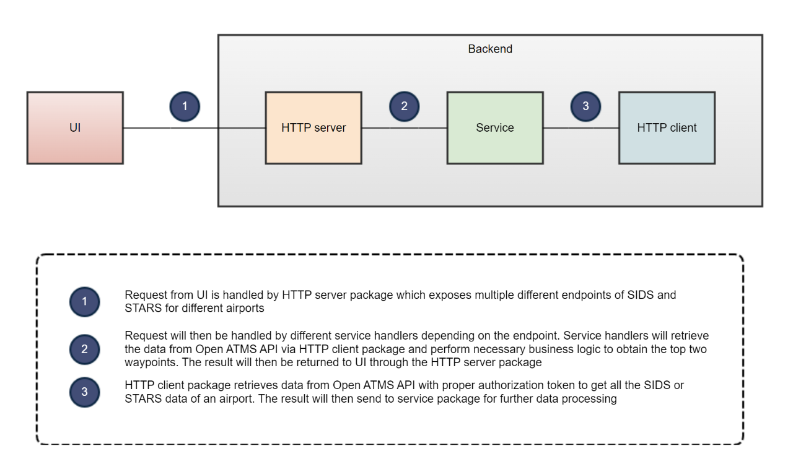
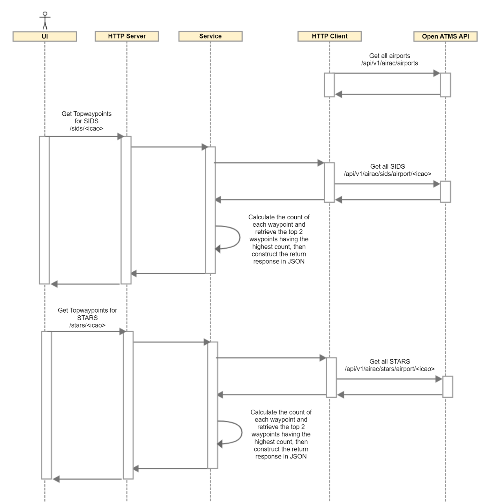

# Table of Content
- [Table of Content](#table-of-content)
- [Introduction](#introduction)
- [Architecture Design](#architecture-design)
  - [Block Diagram](#block-diagram)
  - [Sequence Diagram](#sequence-diagram)
  - [Assumptions](#assumptions)
- [Installation](#installation)
  - [Prerequisites](#prerequisites)
  - [Build](#build)
  - [Install](#install)
- [Future Improvements](#future-improvements)

# Introduction
SIDs and STARs are procedures which are done in an airport and are a stream of waypoints. In this project, a full stack solution is presented to show the top two waypoints that appear more often for the SIDs and STARs for each airport. 
A backend that interrogates the Open ATMS API is created, it is connected to a frontend that allows the selection of airport and presents the information.


# Architecture Design
## Block Diagram


## Sequence Diagram


- Event driven architecture
- If there are more than two waypoints having the same number of count, the last two waypoints will be used as the result


# Installation
## Prerequisites
> **_Note:_** Linux operating system is used in the entire project
- Install [Rancher Desktop](https://rancherdesktop.io/) which comes with WSL, docker, k3s and Helm.
- Export the APIKEY environment variable for successful retrieval of data from Open ATMS API endpoints.
```sh
export APIKEY=<API_KEY>
```

## Build
To build Docker image for SidStar:
```sh
// Backend
docker build . -t localhost:5000/sidstar-be:v1

// Fronted
docker build client/ -t localhost:5000/sidstar-fe:v1
```

Setup Docker local registry and push:
```sh
// Setup Docker local registry
docker run -d -p 5000:5000 --restart=always --name registry registry

// Backend
docker push localhost:5000/sidstar-be:v1

// Frontend
docker push localhost:5000/sidstar-fe:v1
```

## Install
To install the Sidstar project helm chart:
```sh
helm install sidstar helm/ --set global.apiKey=$APIKEY
```

To uninstall:
```sh
helm uninstall sidstar
```

To package the Helm chart:
```sh
helm package helm/ --destination helm/
```


# Future Improvements
- Performance Optimization
  - Revise the algorithm used to retrieve the top two waypoints and look for improvement (performance test, load test)
  - Evaluate the performance of the microservice and identify potential bottlenecks (optimimze resource usage)
  - Caching of frequently used data or resources to improve the response time and scalability of the application
- Scalability and Resilience
  - Use Spring Boot framework
  - Use horizontal scaling techniques such as load balancing and auto-scaling to distribute the workload across multiple instances of the microservice
- Security
  - Use authentication and authorization mechanisms, such as OAuth, JWT, and role-based access control (RBAC), to protect endpoints and data
  - Use Hashicorp Vault or other secrets management tool to store secrets / keys
  - Use HTTPS instead of HTTP to have a secure and encrypted connection
- Monitoring and Logging
  - Set up alerts and notifications to proactively detect and resolve issues before they impact the microservice
  - Use performance monitoring tools to collect and analyze logs, metrics, and traces
- Code Quality
  - Add unit test and automation test
- Improve UI/UX design
- Add end-to-end CI/CD process that will auto build, run test and deploy when there is new approved PR merging to main
